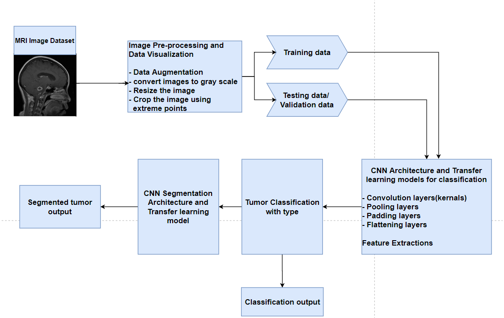
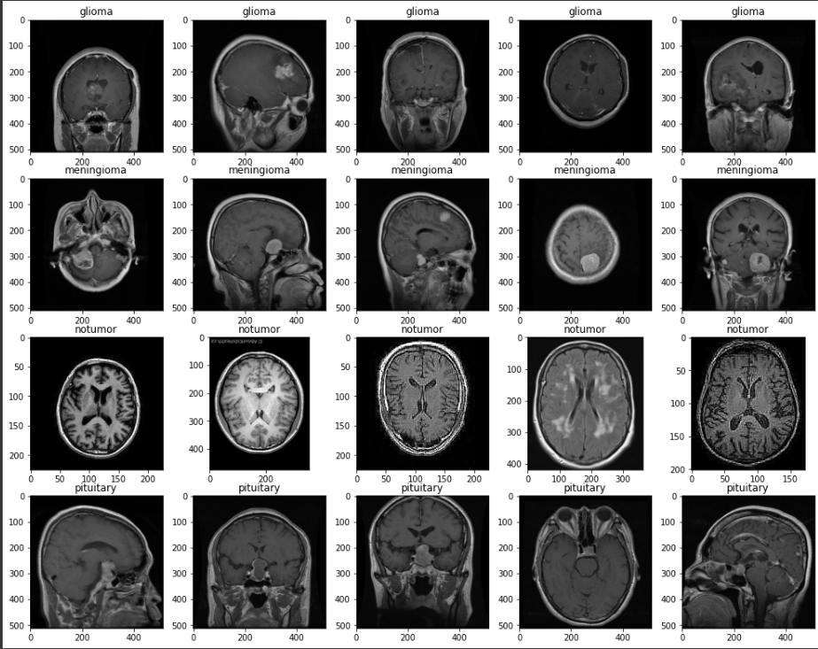
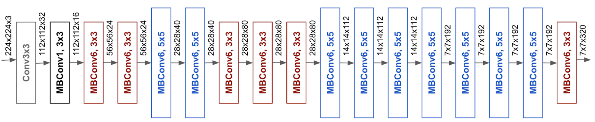
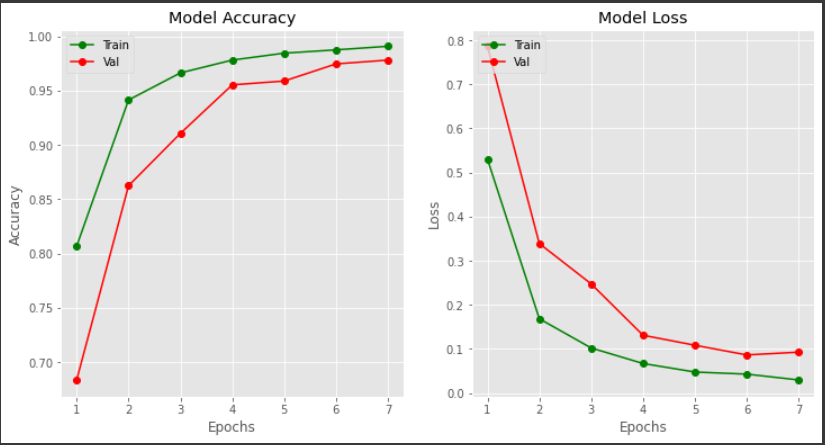

# Brain-Tumor-Multiclass-Classification-and-Segmentation

# Introduction
A brain tumor is a mass of tissue in which the cells multiply uncontrollably. It arises from different cells both in the brain and outside. Primary tumors are the ones that originate in the brain itself, whereas secondary tumors are the ones that metastasize to different parts of the body. Tumors can have different origins based on the cells or the origin obtained from different types of tumors. Numerous imaging techniques can be used to detect and classify brain tumors. However, MRI is one of the most common non-invasive techniques. Popularity comes from the fact of using no ionising radiation during the scan as well as its superior soft-tissue resolution and the ability to acquire different images using various imaging parameters or by employing contrast-enhanced agents. Brain tumors in MRI scans (or any other scans) are identified by abnormal blobs in the brain. These blobs or regions have different illumination than the rest of the brain and are usually brighter than the background. However, the process of segmenting the tumors in MRI images is a very difficult task. The tumors have different sizes, textures, and even positions where they are found. Timely and prompt tumor detection and treatment plans will improve quality of life and increase life expectancy in these patients. The proposed technique uses convolutional neural networks (CNN) to identify and categorise the tumor from brain images of the brain. The main difference between the main channel of the neural network and the normal neural network is that it is able to automatically and locally extract the feature from each image. These types of networks consist of neurons with weights and biases that can be learned

# Project Pipeline

# 1. Brain Tumor Multiclass Classification

## Dataset

[Brain Tumor Multiclass classification MRI Dataset](https://www.kaggle.com/datasets/masoudnickparvar/brain-tumor-mri-dataset/)

This dataset contains 7023 images of human brain MRI images which are classified into 4 classes: Glioma, Meningioma, Pituitary and No tumor.\\

Each MRI image is 1 channel Gray-scale image with dimension 512x512.

## Glioma, Meningioma, Pituitary and No tumor MRI images
In the classification step, a Convolution Neural Network (CNN) model, based on Imagenet architecture, is used to classify the MRI Brain scans into four classes Glioma, Meningioma, Pituitary and no tumor

For the classification purpose by using transfer learning efficientnetB1 architecture of imagenet is used.This function returns a Keras image classification model, optionally loaded with weights pre-trained on Imagenet.

## EfficientB1 Imagenet Architecture

## Model Performance

